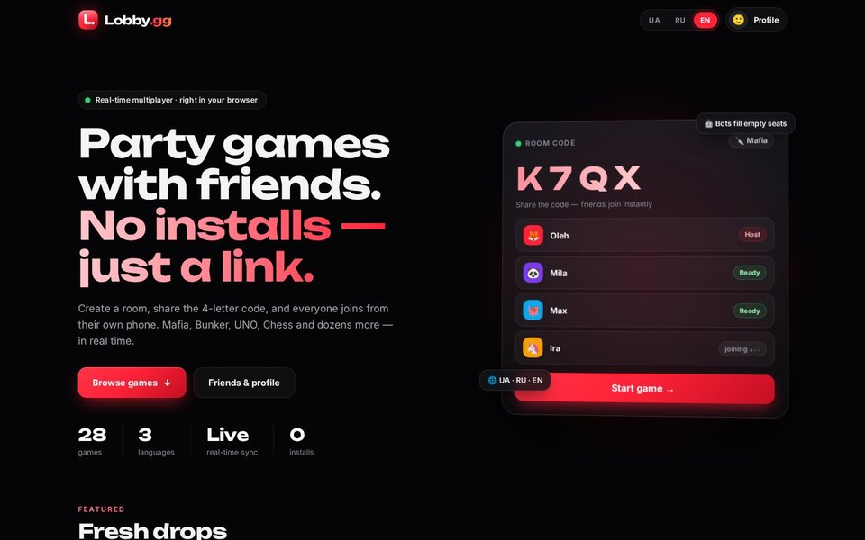
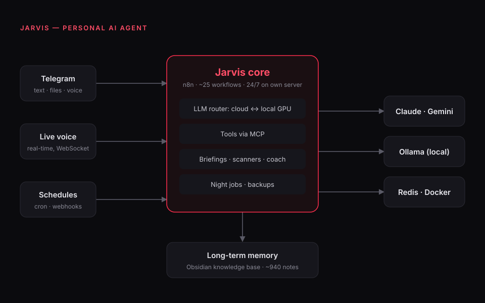
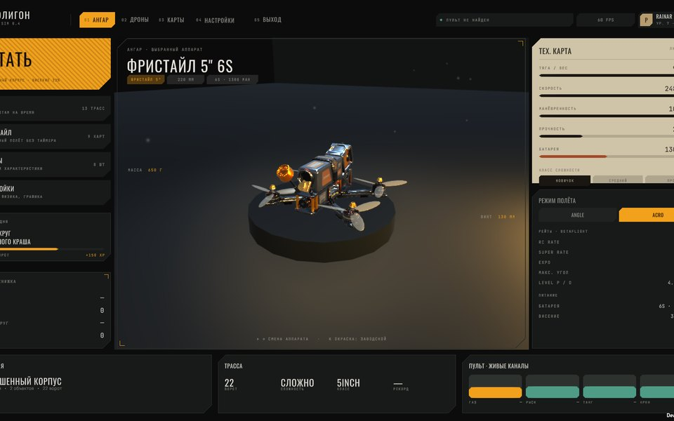
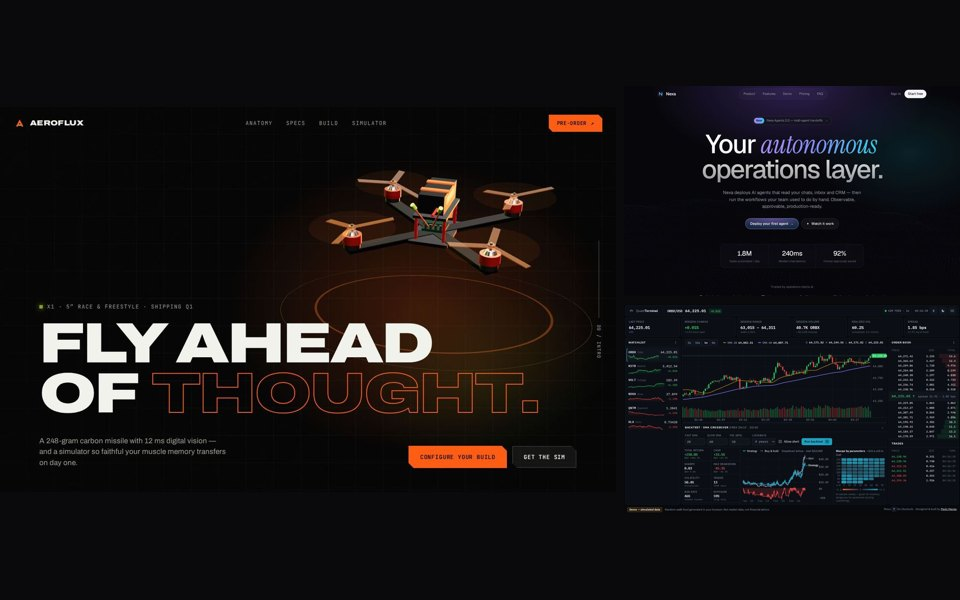

### Pavlo Havras

I build **AI agents and automation systems**, and the **frontends** people actually use.
Self-taught developer and Computer Science student (V. N. Karazin Kharkiv National University), based in Duisburg, Germany. Open to work.

**Portfolio:** [pavlohavras73.github.io](https://pavlohavras73.github.io)

I like owning the whole stack: the Linux server and its firewall, the backend and the real-time protocol, down to the last pixel of the UI. Everything below runs on infrastructure I set up and maintain myself.

---

<table>
<tr>
<td width="50%" valign="top">

**[Lobby.gg](https://promo-dev.duckdns.org/games/)**: real-time multiplayer party games in the browser

28 games (Mafia, Bunker, Spyfall, Poker, Durak, UNO, Chess, 3D Connect-4…). Rooms with 4-letter codes, friends, lobby chat, reconnect mid-game, bots for empty seats, UA / RU / EN.
Server-authoritative game state, so nobody can cheat from the browser console.

`FastAPI` `WebSockets` `vanilla JS` `SQLite` `Docker` `Caddy`
[Live demo](https://promo-dev.duckdns.org/games/) · [Code](https://github.com/pavlohavras73/lobby-gg)

</td>
<td width="50%" valign="top">

**Jarvis**: my personal AI agent, running 24/7 on my own server

Telegram and real-time voice in, ~25 n8n workflows inside (morning briefing, market scanner, habit coach, night jobs). Requests are routed between cloud LLMs and local models on my GPU. Long-term memory is an Obsidian knowledge base with ~940 notes.

`n8n` `Claude` `Gemini` `Ollama` `MCP` `Redis` `Docker`

</td>
</tr>
<tr>
<td width="50%" valign="top">

**FPV drone simulator**: physics first, flown with a real radio

My own flight model: a Python reference implementation with golden tests, ported to a C# engine. PID auto-tuner, battery sag, motor spin-up, procedural maps from a Blender pipeline. 8 drones modelled from manufacturer data, flown with a RadioMaster transmitter.

`Unity 6` `C#` `Python` `Blender`

</td>
<td width="50%" valign="top">

**[Web showcase](https://pavlohavras73.github.io/#web)**: seven sites, designed and built by me

AeroFlux (FPV brand with a 3D drone), Nexa AI, Quant Terminal (live trading dashboard), plus four product concepts with full marketing sites and app screens: AutoMind, BotForge, VoxDesk, AeroRace.

`HTML/CSS` `JavaScript` `three.js` `GSAP` `Tailwind`
[Open the showcase](https://pavlohavras73.github.io)

</td>
</tr>
</table>

Also: my own **Linux desktop shell** on Hyprland + AGS, with an AI command bar wired to Jarvis (`TypeScript` `GTK`), and an **honest backtester** for trading strategies with fees, slippage stress tests, look-ahead guards and walk-forward validation (`Python`).

---

#### Toolbox

- **Frontend:** TypeScript, JavaScript, HTML/CSS, three.js, GSAP, WebSockets
- **Backend:** Python, FastAPI, Node.js, SQLite / Postgres, Redis
- **AI & automation:** n8n, LLM APIs (Claude, Gemini), Ollama, MCP, Playwright, agentic coding
- **Ops:** Linux, Docker, Caddy, Git, CI, server hardening, backups

**Languages:** Ukrainian · Russian · English · German

---

**Contact:** pavlo.havras73@gmail.com · Telegram [@rainar_73](https://t.me/rainar_73)
